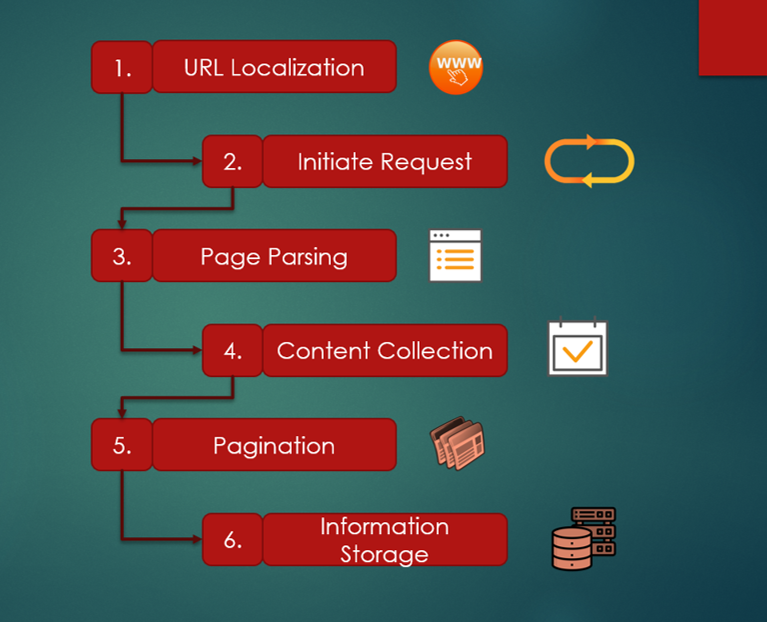

# Web-Scraping

This repository contains Web Scraping Projects using Python

* To begin using project, create a virtual environment:
  
```bash
python -m venv /path/to/new/virtual/environment
```

* Activate the Virtual Environment (command can vary on Windows or Linux based systems).
  
```bash
source </path/to/new/virtual/environment>/bin/activate
```

* For instance:

```bash
python -m venv .scrape
source .scrape/bin/activate
```

* Install the dependencies: `pip install -r requirements.txt`

---

> Learn Basics of Scraping by referring to `Web Scraping.ipynb`

---

## Projects

### Live Projects

* **WikiCompanies**: This project utilizes Scrapy aims to scrape all US companies and its firmographics data from the Wikipedia infobox.

* **BuySellUnlistedShares**: A simple web scraping script using BeautifulSoap that aims to scrape unlisted companies of India from URL: `https://buysellunlistedshares.com/`.

* **AZLyrics**: Using BeautifulSoap and Selenium, this project aims to scrape music information such as artists, albums, songs, and lyrics from URL: `https://azlyrics.com/`.

### Unsupported Projects (Deprecated)

* **Rurash Financials**: This is a Selenium based web scraping script that aims to scrape unlisted companies of India from URL: `https://rurashfin.com/unlisted-shares-list/`.

* **UnlistedDeal**: This is a Selenium based web scraping script that aims to scrape unlisted companies of India from URL: `https://www.unlisteddeal.com/unlisted-share/`.

* **UnlistedZoneShares**: This is a Scrapy project that aims to scrape unlisted companies of India from URL: `https://unlistedzone.com/shares/`.

* **WWIPL**: This is a Selenium based project that aims to scrape unlisted companies of India from URL: `https://wwipl.com/`.

* **UnlistedShareBrokers**: This is a Selenium based web scraping script that aims to scrape unlisted companies of India from URL: `https://www.unlistedsharebrokers.com/`.

---

### Getting Started with Scrapy

* To create a new project, run the following command in the terminal: `scrapy startproject my_first_spider`

* To create a new spider, first change the directory: `cd my_first_spider`

* Create a spider: `scrapy genspider example example.com`.
When we create a spider, we obtain a Basic Template. The class is built with the data we introduced in the previous command, but the parse method needs to be built by us.

* Run the spider and export data to CSV or JSON

```bash
scrapy crawl example
scrapy crawl example -o name_of_file.csv
scrapy crawl example -o name_of_file.json
```

---

### • Scrapy Directory

Directory Diagram of Scrapy


### • Scraping Flow

Process flow of the scraping process.

